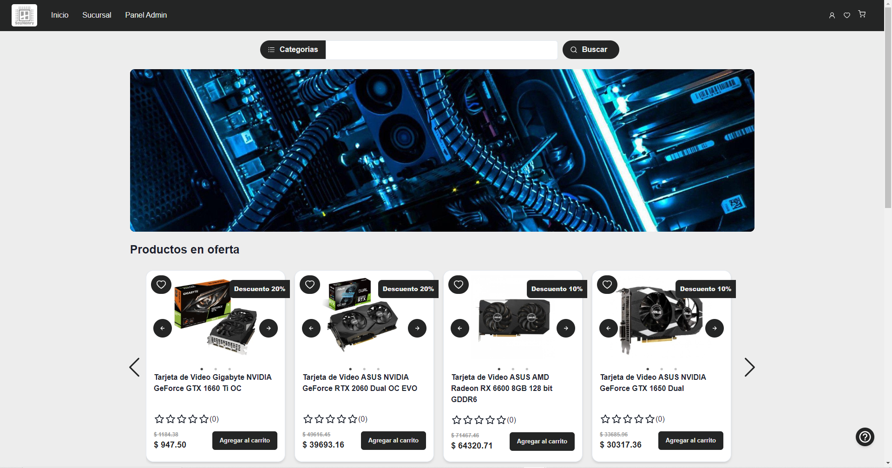
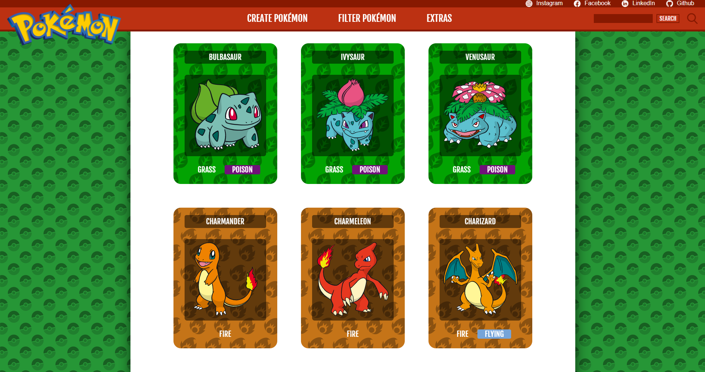

<h1 align="center">Hi 👋, My name is</h1>

<h3 align="center">I am 28 years old and I am a full-stack web developer.</h3>

 

- 🔭 I am currently working on personal projects
- 🌱 I am learning English and improving my programming knowledge.
- 💬 Ask me about JavaScript, React, Redux, HTML, CSS, Node.js, Sass, Express, PostgreSQL, Sequelize, TypeScript.
- 📫 You can contact me through my email:: Leonel.Retamar33@gmail.com

- 📄 I have collaborated on projects with other developers. If you need assistance, feel free to contact me. :rocket:

- ⚡ Fun Fact: During my learning process, I acquired an extraordinary skill, and now I can measure the difficulty of a project based on the number of cups of tea I drink during the first few hours of work. 😄.

 

<h3 align="left">Lenguages:</h3>

 

<h3 align="left">FrontEnd:</h3>

 
 
 
 

<a href="https://lesscss.org/"><a/>
<a href="https://chakra-ui.com/">

<h3 align="left">BackEnd:</h3>

 
 
 

 

 

<h3 align="left">How to reach me:</h3>

 
 

<h3 align="left">📊GitHub Stats:</h3>

 

&nbsp;

 
 

 
 

 

<h1 align="center" >Projects</h1>

<!--
**LeonelR33/LeonelR33** is a ✨ _special_ ✨ repository because its `README.md` (this file) appears on your GitHub profile.

Here are some ideas to get you started:

- 🔭 I’m currently working on ...
- 🌱 I’m currently learning ...
- 👯 I’m looking to collaborate on ...
- 🤔 I’m looking for help with ...
- 💬 Ask me about ...
- 📫 How to reach me: ...
- 😄 Pronouns: ...
- ⚡ Fun fact: ...
-->
